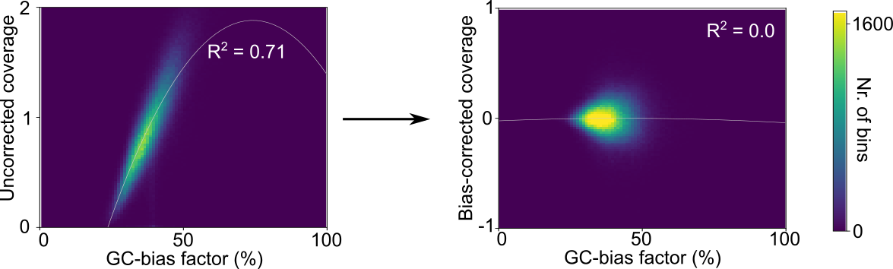
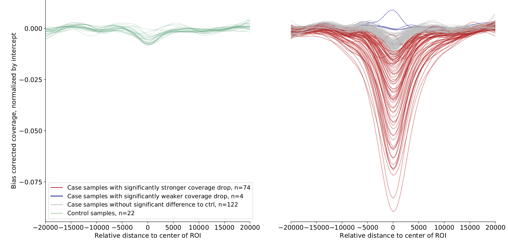

Thank you for your interest in LIQUORICE!

Introduction
============

``LIQUORICE`` is a command-line-tool and python package for bias correction and quantification of changes
in coverage around regions of interest in cfDNA WGS datasets. ``LIQUORICE`` can be used to detect and quantify
tissue or cancer-specific epigenetic signatures in liquid biopsies. This allows accurate quantification of the
fraction of tumor-derived cell-free DNA, `as demonstrated in our recent publication <https://doi.org/10.1038/s41467-021-23445-w>`_.

Motivation
**********

The fragmentation of cell-free DNA (cfDNA) obtained from liquid biopsies is non-random, and contains information about
the
epigenetic state of its cell-of-origin. DNA in nucleosomes is protected from cleavage, resulting in an increase in
sequencing coverage in genomic regions that are occupied by nucleosomes. If a set of genomic regions is
specifically accessible in a cell-type of interest (such as a certain cancer type), an observed decrease in coverage
around these regions can indicate that cells of this type are present in the organism, and are releasing cfDNA
into the bloodstream.

What ``LIQUORICE`` does
***********************

``LIQUORICE`` addresses two problems regarding the quantification of epigenetic signatures from a coverage signal:

-  Coverage is influenced by bias-factors, such as GC-content, mappability and other factors related to sequence composition
-  The coverage signal needs to be summarized over all regions in a region-set, and needs to be quantified as a number that is robust and comparable between samples.

In a first step, ``LIQUORICE`` trains a bias-model, which learns the association between bias-factors and coverage. Then,
the trained model is used to correct the coverage signal in the regions of interest. Finally, the signal is
aggregated between regions and quantified by fitting a model to the data. ``LIQUORICE`` produces tables as well as plots
that allow for the visual inspection of biases and of the coverage signal. Furthermore, a summary tool is included,
which allows for the convenient comparison of signals between samples and region-sets.

Region-sets
***********

In the context of ``LIQUORICE``, we refer to a region-set as a set of genomic regions with similar properties. This
could be, e.g., enhancers or DNaseI-hypersensitivity sites that are specific for a cell-type, cancer-type, or tissue.
Useful ressources to obtain such region-sets include `https://dnase.genome.duke.edu/ <https://dnase.genome.duke
.edu/>`_ and `ENCODE <https://www.encodeproject.org/>`_.

How to use ``LIQUORICE``
************************
The first version of ``LIQUORICE`` is described `here <https://medical-epigenomics.org/papers/peneder2020_f17c4e3befc643ffbb31e69f43630748/code/figure5/figure5.html>`_
and available for download `here <https://medical-epigenomics.org/papers/peneder2020_f17c4e3befc643ffbb31e69f43630748/code/figure5/>`_.
You can find the instructions for setting up the appropriate conda environment `here <https://medical-epigenomics.org/papers/peneder2020_f17c4e3befc643ffbb31e69f43630748/#code>`_.

**We are currently working on a new, improved version of LIQUORICE.** It will be available shortly and will have several advantages over the previous version:

- Installation via ``conda`` for easy dependency management
- Run directly from mapped bam files, other input data generation steps are now integrated into the tool
- Shorter runtime and more efficient parallelization
- Includes a well-documented python package, allowing convenient modification and re-use of parts of the workflow
- Command-line function to summarize output over multiple samples and region-sets & compare case and control samples.

We are currently still optimizing some parameters, other than that the new version is ready to go. Any updates will be posted here. If you are interested in trying out the new version already now, just get in touch and contact peter.peneder@ccri.at.

Here are a few examples of ``LIQUORICE``'s output:

.. image:: img/fitted_gaussians_example.png
  :width: 100
  :alt: Model fitting example

Potential application areas
***************************

``LIQUORICE`` could be useful for a variety of cfDNA-related analysis tasks:

- Cancer detection, classification, monitoring and survival prognosis (`as demonstrated in our recent publication <https://doi.org/10.1038/s41467-021-23445-w>`_)
- Classification of cancers of unknown primary
- Location of metastasis
- Tissue damage monitoring for transplantations, heart attack, and other diseases

Contact
========
If you have any questions about ``LIQUORICE`` and how to apply it to your data, create an issue or contact peter.peneder@ccri.at - we are happy to hear from you.

Citation
========

If you use ``LIQUORICE`` in any published work, please cite:

`Peneder, P., Stütz, A. M., Surdez, D., Krumbholz, M., Semper, S., Chicard, M., ... & Tomazou, E. M. (2021). Multimodal analysis of cell-free DNA whole-genome sequencing for pediatric cancers with low mutational burden. Nature communications, 12(1), 1-16.`
